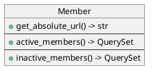

# Accounts

Extends[^?] django's User model, and add custom views and forms for user registration, password management and profile management.

---

## Models

### Member

A proxy model for `django.contrib.auth.User`, provides the following methods:

- `get_absolute_url(self) -> str`: get member's profile
- `active_members(self) -> QuerySet`: get all active members
- `inactive_members(self) -> QuerySet`: get all inactive members

---

## Views

### MemberSignUpView

- **class based view**: `CreateView`
- **super class**: None
- **mixins**: `AnonymousUserMixin`
- Create a new member, and redirects to the user to login page.
- Username must be unique, though it can be changed later.

### MemberDeactivateView

- **class based view**: `UpdateView`
- **super class**: None
- **mixins**: `MemberLoginRequiredMixin, OwnerMemberRequiredMixin`
- Deactivate current user's member account.
- A deactivated member will be logged out and can not sign in again until the account is activated.

> Currently, only admin members can activate other accounts.

### MemberDeleteView

- **class based view**: `DeleteView`
- **super class**: `None`
- **mixins**: `MemberLoginRequiredMixin, OwnerMemberRequiredMixin`
- Delete member account.
- All data related to the member are removed and can't be recovered. The operation can't be recovered.

### MemberEditView

- **class based view**: `UpdateView`
- **super class**: `None`
- **mixins**: `MemberLoginRequiredMixin, OwnerMemberRequiredMixin`
- Edit user's own member profile.

### MemberLoginView

- **class based view**: `None`
- **super class**: `LoginView`
- **mixins**: `None`
- Log the user in using their member account.

### MemberLogoutView

- **class based view**: `None`
- **super class**: `LogoutView`
- **mixins**: `None`
- Log the user out.

### MemberProfileView

- **class based view**: `DetailView`
- **super class**: `None`
- **mixins**: `MemberLoginRequiredMixin`
- Display member's account information.

### MemberOwnProfileView

- **class based view**: `View`
- **super class**: `None`
- **mixins**: `MemberLoginRequiredMixin`
- Display the user's own member account information.

### MemberPasswordResetView

- **class based view**: `None`
- **super class**: `PasswordResetView`
- **mixins**: `AnonymousUserMixin`
- Request password reset for the user's account, if the user forgot their password.

> requires member's email

### MemberPasswordResetDoneView

- **class based view**: `None`
- **super class**: `PasswordResetDoneView`
- **mixins**: `AnonymousUserMixin`
- Informs the user of password reset instructions.

### MemberPasswordResetConfirmView

- **class based view**: `None`
- **super class**: `PasswordResetConfirmView`
- **mixins**: `AnonymousUserMixin`
- Confirm user's account password reset.
- Allows user to enter a new password.

### MemberPasswordResetCompleteView

- **class based view**: `None`
- **super class**: `PasswordResetCompleteView`
- **mixins**: `AnonymousUserMixin`
- Informs the user that the password was reset successfully.

### MemberPasswordChangeView

- **class based view**: `None`
- **super class**: `PasswordChangeView`
- **mixins**: `None`
- Change user's own member account password.
- New password must be different from old password.

### MemberPasswordChangeDoneView

- **class based view**: `None`
- **super class**: `PasswordChangeDoneView`
- **mixins**: `None`
- Informs the user that their password was changed successfully.

---

## Forms

### MemberSignUpForm

- **base form**: `UserCreationForm`
- **mixins**: `None`
- Member sign up form.
- Creates a normal account (not staff, or superuser).
- Extends's Django `UserCreationForm` by adding input fields for:
  - first_name
  - last_name
  - email
- Additional fields are not required.

### MemberEditForm

- **base form**: `UserChangeForm`
- **mixins**: `UniqueUsernameMixin`
- Form to edit user's member account details.

### MemberConfirmActionForm(NoSaveMixin, ModelForm)

- **base form**: `ModelForm`
- **mixins**: `NoSaveMixin`
- Asks user for his account's password as a confirmation for some action.

### MemberPasswordResetForm(PasswordResetForm)

- **base form**: `PasswordResetForm`
- **mixins**: `None`
- Form to reset user's account password.
- Accepts emails that are not associated with any current members' accounts.

### MemberPasswordResetConfirmForm(UniquePasswordMixin, PasswordResetForm)

- **base form**: `PasswordResetForm`
- **mixins**: `UniquePasswordMixin`
- Form to enter new password, after password reset.

### MemberPasswordChangeForm(UniquePasswordMixin, PasswordChangeForm)

- **base form**: `PasswordChangeForm`
- **mixins**: `UniquePasswordMixin`
- Form to change user's account password.
- New password must be different from old password.

---

## URLs

### accounts/signup/

- view: [MemberSignUpView](#membersignupview)
- name: `accounts:signup`

### accounts/login/

- name: `accounts:login`
- view: [MemberLoginView](#memberloginview)

### accounts/logout/

- name: `accounts:logout`
- view: [MemberLogoutView](#memberlogoutview)

### accounts/my_profile/

- name: `accounts:my_profile`
- view: [MemberOwnProfileView](#memberownprofileview)

### accounts/password_reset/

- name: `accounts:password_reset`
- view: [PasswordResetView](#memberpasswordresetview)

### accounts/password_reset/done/

- name: `accounts:password_reset_done`
- view: [PasswordResetDoneView](#memberpasswordresetdoneview)

### accounts/password_reset/confirm/\<slug:uidb64>/\<slug:token>/

- name: `accounts:password_reset_confirm`
- view: [PasswordResetConfirmView](#memberpasswordresetconfirmview)

### accounts/password_reset/complete/

- name: `accounts:password_reset_complete`
- view: [PasswordResetCompleteView](#memberpasswordresetcompleteview)

### accounts/password_change/

- name: `accounts:password_change`
- view: [PasswordChangeView](#memberpasswordchangeview)

### accounts/password_change/done/

- name: `accounts:password_change_done`
- view: [PasswordChangeDoneView](#memberpasswordchangedoneview)

### accounts/\<slug:user_name>/profile/

- name: `accounts:profile`
- view: [MemberProfileView](#memberprofileview)

### accounts/\<slug:user_name>/edit/

- name: `accounts:profile_edit`
- view: [MemberEditView](#membereditview)

### accounts/\<slug:user_name>/deactivate/

- name: `accounts:account_deactivate`
- view: [MemberDeactivateView](#memberdeactivateview)

### accounts/\<slug:user_name>/delete/

- name: `accounts:account_delete`
- view: [MemberDeleteView](#memberdeleteview)

[^?]: Not really an extension and more like a wrapper. No new fields are added to the user model. Apart from light functions, every things else is pretty much the same as the `User` model.
