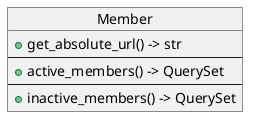

# Accounts

Extends[^?] django's User model, and add custom views and forms for user registration, password management and profile management.

## Accounts.Models

### Member

A proxy model for `django.contrib.auth.User`, provides the following methods:

- `get_absolute_url(self) -> str`: get member's profile
- `active_members(self) -> QuerySet`: get all active members
- `inactive_members(self) -> QuerySet`: get all inactive members

## Accounts.Views

### Views Mixins

#### AnonymousUserMixin(AccessMixin)

- Makes the view available only for anonymous users.
- Redirects logged in users to homepage.
- Requires `redirect_url`.

### LoginRequiredMixin

- Makes the view available only for logged in users.
- Redirects anonymous users to login page.
- Requires `login_url`.

#### OwnerMixin(AccessMixin)

- Makes the view available only for the object's owner.
- Returns `403 Forbidden` error when the view is accessed by users other than the object's owner.

### Views

#### MemberSignUpView(AnonymousUserMixin, CreateView)

- Create a new member, and redirects to the user to login page.
- Username must be unique, though it can be changed later.

#### MemberDeactivateView(LoginRequiredMixin, OwnerMixin, UpdateView)

- Deactivate current user's member account.
- A deactivated member will be logged out and can not sign in again until the account is activated.

> Currently, only admin members can activate other accounts.

#### MemberDeleteView(LoginRequiredMixin, OwnerMixin, DeleteView)

- Delete member account.
- All data related to the member are removed and can't be recovered. The operation can't be recovered.

#### MemberEditView(LoginRequiredMixin, OwnerMixin, UpdateView)

- Edit user's own member profile.

#### MemberLoginView(LoginView)

- Log the user in using their member account.

#### MemberLogoutView(LogoutView)

- Log the user out.

#### MemberProfileView(LoginRequiredMixin, DetailView)

- Display member's account information.

#### MemberOwnProfileView(LoginRequiredMixin, View)

- Display the user's own member account information.

#### MemberPasswordResetView(AnonymousUserMixin, PasswordResetView)

- Request password reset for the user's account, if the user forgot their password.

> requires member's email

#### MemberPasswordResetDoneView(AnonymousUserMixin, PasswordResetDoneView)

- Informs the user of password reset instructions.

#### MemberPasswordResetConfirmView(AnonymousUserMixin, PasswordResetConfirmView)

- Confirm user's account password reset.
- Allows user to enter a new password.

#### MemberPasswordResetCompleteView(AnonymousUserMixin, PasswordResetCompleteView)

- Informs the user that the password was reset successfully.

#### MemberPasswordChangeView(PasswordChangeView)

- Change user's own member account password.
- New password must be different from old password.

#### MemberPasswordChangeDoneView(PasswordChangeDoneView)

- Informs the user that their password was changed successfully.

## Accounts.Forms

### Forms Mixins

#### NoSaveMixin

- Prevents the model form from saving the object.
- Overrides `ModelForm.save()` method to alway call `super().save(commit=False)`.

#### UniquePasswordMixin

- Checks the the form's `password2` field is different from current user's password.

#### UniqueUsernameMixin

- Checks that the form's `username` field is unique (case sensitive).
- Only checks the field if it was changed.

### Forms

#### MemberSignUpForm(UserCreationForm)

- Member sign up form.
- Creates a normal account (not staff, or superuser).
- Extends's Django `UserCreationForm` by adding input fields for:
  - first_name
  - last_name
  - email
- Additional fields are not required.

#### MemberEditForm(UniqueUsernameMixin, UserChangeForm)

- Form to edit user's member account details.

#### MemberConfirmActionForm(NoSaveMixin, ModelForm)

- Asks user for his account's password as a confirmation for some action.

#### MemberPasswordResetForm(PasswordResetForm)

- Form to reset user's account password.
- Accepts emails that are not associated with any current members' accounts.

#### MemberPasswordResetConfirmForm(UniquePasswordMixin, PasswordResetForm)

- Form to enter new password, after password reset.

#### MemberPasswordChangeForm(UniquePasswordMixin, PasswordChangeForm)

- Form to change user's account password.
- New password must be different from old password.

## Accounts.URLs

### accounts/signup/

- view: [MemberSignUpView](#membersignupviewanonymoususermixin-createview)
- name: `accounts:signup`

### accounts/login/

- name: `accounts:login`
- view: [MemberLoginView](#memberloginviewloginview)

### accounts/logout/

- name: `accounts:logout`
- view: [MemberLogoutView](#memberlogoutviewlogoutview)

### accounts/my_profile/

- name: `accounts:my_profile`
- view: [MemberOwnProfileView](#memberownprofileviewloginrequiredmixin-view)

### accounts/password_reset/

- name: `accounts:password_reset`
- view: [PasswordResetView](#memberpasswordresetviewanonymoususermixin-passwordresetview)

### accounts/password_reset/done/

- name: `accounts:password_reset_done`
- view: [PasswordResetDoneView](#memberpasswordresetdoneviewanonymoususermixin-passwordresetdoneview)

### accounts/password_reset/confirm/\<slug:uidb64>/\<slug:token>/

- name: `accounts:password_reset_confirm`
- view: [PasswordResetConfirmView](#memberpasswordresetconfirmviewanonymoususermixin-passwordresetconfirmview)

### accounts/password_reset/complete/

- name: `accounts:password_reset_complete`
- view: [PasswordResetCompleteView](#memberpasswordresetcompleteviewanonymoususermixin-passwordresetcompleteview)

### accounts/password_change/

- name: `accounts:password_change`
- view: [PasswordChangeView](#memberpasswordchangeviewpasswordchangeview)

### accounts/password_change/done/

- name: `accounts:password_change_done`
- view: [PasswordChangeDoneView](#memberpasswordchangedoneviewpasswordchangedoneview)

### accounts/\<slug:user_name>/profile/

- name: `accounts:profile`
- view: [MemberProfileView](#memberprofileviewloginrequiredmixin-detailview)

### accounts/\<slug:user_name>/edit/

- name: `accounts:profile_edit`
- view: [MemberEditView](#membereditviewloginrequiredmixin-ownermixin-updateview)

### accounts/\<slug:user_name>/deactivate/

- name: `accounts:account_deactivate`
- view: [MemberDeactivateView](#memberdeactivateviewloginrequiredmixin-ownermixin-updateview)

### accounts/\<slug:user_name>/delete/

- name: `accounts:account_delete`
- view: [MemberDeleteView](#memberdeleteviewloginrequiredmixin-ownermixin-deleteview)

[^?]: Not really an extension and more like a wrapper. No new fields are added to the user model. Apart from light functions, every things else is pretty much the same as the `User` model.
